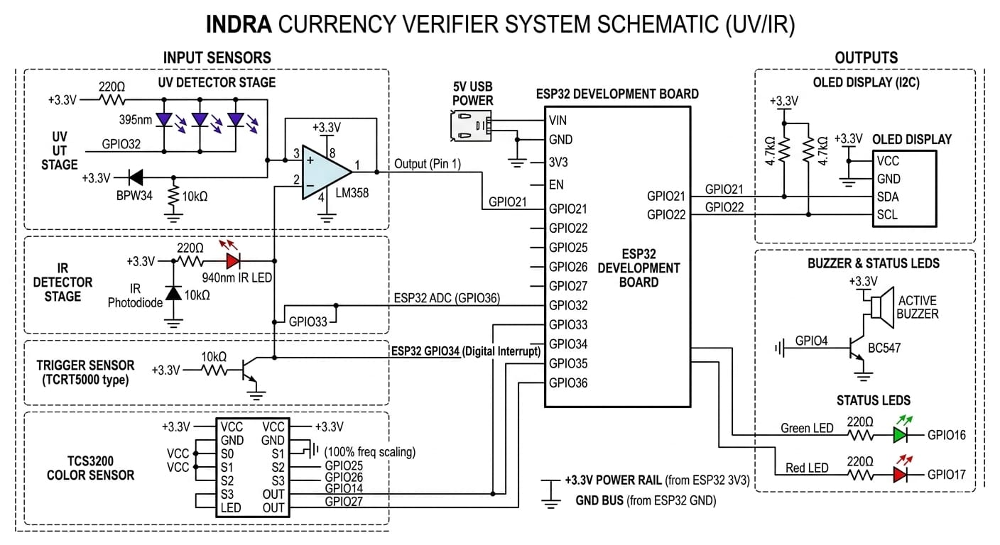

## Introduction

**INDRA** (Intelligent Note Detector And Rupee Authenticator) is an ESP32-based currency verification system for Indian Rupee banknotes. It uses a TCS3200 RGB color sensor for denomination identification, UV fluorescence detection for paper authenticity, and IR absorption detection for ink verification. The firmware runs as a non-blocking state machine.

---

## File Structure

```
INDRA/
├── assets/
│   └── schematic.jpeg      # Circuit schematic (UV/IR sensor system)
├── INDRA.ino                # Main firmware (state machine)
├── config.h                 # Pin definitions & calibration thresholds
└── README.md
```

---

## Hardware

### Components

* ESP32 Development Board
* TCS3200 Color Sensor (S0/S1 hardwired to 3.3V)
* TCRT5000 Proximity Sensor (note trigger)
* 395nm UV LEDs + BPW34 Photodiode + LM358 Op-Amp
* 850/940nm IR LEDs + IR Photodiode
* 0.96" I2C OLED (SSD1306)
* Active Buzzer (driven via BC547 transistor)
* Green and Red Status LEDs

### Pin Mapping

| Function         | GPIO |
|------------------|------|
| Trigger (TCRT5000) | 34 |
| TCS3200 S2       | 25   |
| TCS3200 S3       | 26   |
| TCS3200 OUT      | 27   |
| TCS3200 LED      | 14   |
| UV Emitter       | 32   |
| UV Receiver (ADC)| 35   |
| IR Emitter       | 33   |
| IR Receiver (ADC)| 36   |
| OLED SDA         | 21   |
| OLED SCL         | 22   |
| Buzzer           | 4    |
| Green LED        | 16   |
| Red LED          | 17   |

### Circuit Schematic


---

## Operational Pipeline

The firmware runs a 7-state sequential pipeline:

1. **Idle** - OLED displays "Insert Note", all emitters OFF, waiting for TCRT5000 interrupt.
2. **Triggered** - Debounce check (50ms) to confirm note presence.
3. **Color Profiling** - TCS3200 reads R/G/B pulse widths, matches against denomination thresholds.
4. **UV Paper Test** - UV LEDs ON, 10-sample averaged ADC read. Genuine notes absorb UV (low ADC), fakes fluoresce (high ADC).
5. **IR Ink Test** - IR LEDs ON, 10-sample averaged ADC read. Genuine ink causes IR dropout (low ADC).
6. **Decision** - All three checks (color + UV + IR) must pass.
7. **Output** - Green LED + "Genuine Rs.XXX" or Red LED + buzzer + "COUNTERFEIT". Holds for 3 seconds, then resets.

---

## Getting Started

### Prerequisites

* Arduino IDE with ESP32 board support installed
* Libraries: `Adafruit SSD1306`, `Adafruit GFX` (install via Library Manager)

### Upload

1. Open `INDRA.ino` in Arduino IDE.
2. Select your ESP32 board and COM port.
3. Upload.

### Calibration

1. Open Serial Monitor at 115200 baud.
2. Insert real banknotes and note the `[COLOR]`, `[UV]`, and `[IR]` values printed.
3. Insert fake/photocopy paper and note those values.
4. Update `UV_THRESHOLD` and `IR_THRESHOLD` in `config.h`.
5. Update the RGB ranges inside `identifyDenomination()` in `INDRA.ino`.

---

## To-Do

- [x] Complete the firmware code
- [ ] Complete the circuit on breadboard
- [ ] Assemble and verify the circuit

---

## License

MIT
